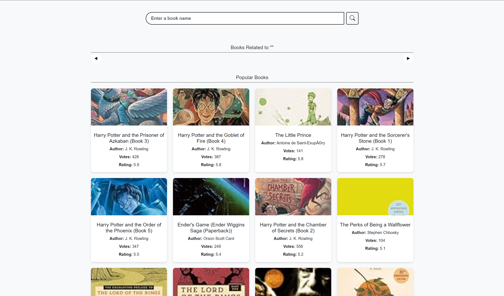
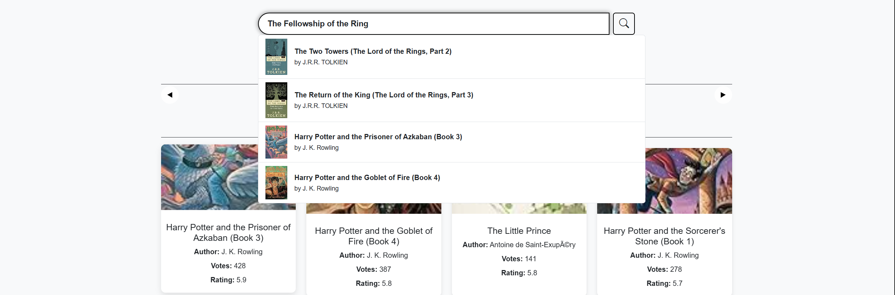
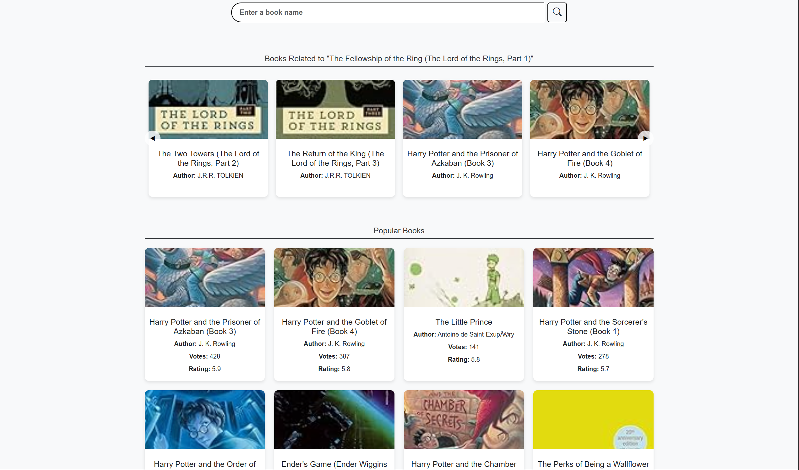

# 📚 The Ultimate Book Recommender: Your Next Read Awaits! 🚀

---

## 💡 Project Overview

Tired of endless scrolling? Meet the **Book Recommendation System**—a smart, collaborative filtering engine built to instantly connect you with your next favorite book. Powered by **Python**, **Pandas**, and **Scikit-learn**, and served up through a sleek **Flask web application**, this project dives into the world of user-book ratings to find hidden gems just for you.

It's all about **collaborative filtering**: if users similar to you loved a book, you probably will too!

---

## ✨ Core Features & Magic Behind the Scenes

* **🔍 Instant Recommendations:** Just type a book title, and get the **top 10 personalized suggestions** delivered instantly.
* **🤝 Pure Collaborative Power:** We use **cosine similarity** on the massive user-book rating matrix to find genuinely similar titles.
* **🧠 Lightning Fast:** No waiting! Data and similarity scores are pre-computed and quickly loaded from **`.pkl` files**, ensuring a smooth, real-time experience.
* **🌐 Minimalist Web Interface:** A clean, intuitive UI makes browsing and getting recommendations a breeze.
* **🔧 Designed for Growth:** The architecture is simple, making it **easy to extend** with advanced algorithms like SVD, Matrix Factorization, or content-based methods.

---

## 🖥️ A Peek Inside

Check out the simplicity and functionality of the web application:

| Showcase | Search Feature | Output |
| :---: | :---: | :---: |
|  |  |  |

> 🖼️ **Note:** Place your awesome screenshots in an `assets/` folder to see them here! If you host on GitHub, you can use raw image URLs for continuous integration with your repo.

---

## 🛠️ The Tech Stack Arsenal

| Category | Tools / Libraries | Purpose |
| :--- | :--- | :--- |
| **Language** | **Python 3.13** | The backbone of the entire system. |
| **Data Science** | **Pandas, NumPy, Scikit-learn** | Data manipulation, matrix creation, and the core similarity algorithm. |
| **Web Framework** | **Flask** | Serving the model predictions via a lightweight web app. |
| **Persistency** | **Pickle** | Saving/loading the pre-trained similarity matrix for speed. |
| **Frontend** | **HTML, CSS, Jinja Templates** | The user-facing interface and dynamic rendering. |
| **Data Source** | `Books.csv`, `Users.csv`, `Ratings.csv` | The raw input for training the model. |

---

## 🚀 Get It Running: Installation & Setup

Ready to start recommending? Follow these quick steps!

### 1. Clone the Repository
Open your terminal and run:

```bash
git clone [https://github.com/RohanMishra101/Book-Recommendation-System.git](https://github.com/RohanMishra101/Book-Recommendation-System.git)
cd Book-Recommendation-System
